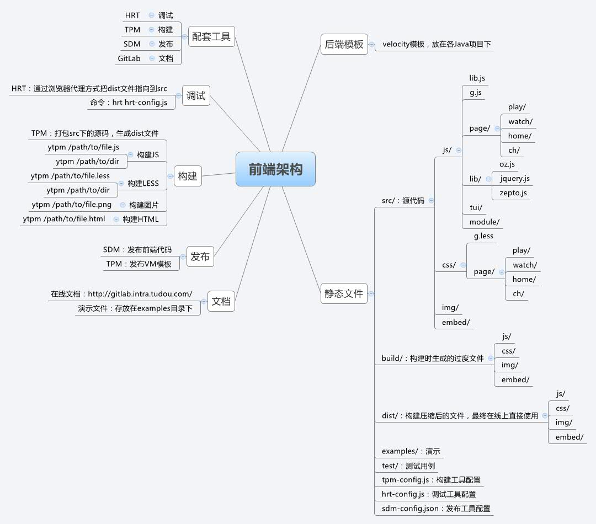
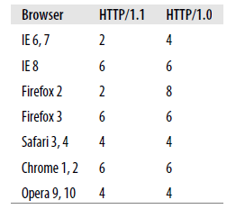

title: 土豆前端架构
author:
  name: 土豆前端
  url: http://gitlab.intra.tudou.com/static/wiki/wikis/home
output: tudou.html
theme: sudodoki/reveal-cleaver-theme
--

# 土豆前端介绍 

--

* 前端架构

* 开发流程

* 性能优化

--

## 前端架构职能

* 响应快
* 易开发、调试
* 易维护
* 可扩展

--

## 响应快

* 通过代理本地开发快速定位问题
* 自动化前端构建和发布工具

--

## 易开发

* 版本管理（git）
* 环境易部署，减化上线操作（node hrt ytpm sdm）
* 通过代理工具(hrt)进行本地调试
* 前端库（less requireJs   art）

--

## 易维护

* 目录结构清晰（通用模块，业务组件，业务模块）
* 代码结构清晰（AMD+MV* 数据驱动 代码结构解耦）

--
## 可扩展

* 构建、发布工具可配置
* jshint、autoperfixer

-- 
##  土豆前端架构图

--

--

## 前端工具

* [代理工具:hrt](http://git.intra.tudou.com/static/hrt.git)
* [构建工具:tpm](http://git.intra.tudou.com:static/tpm.git)
* [发布工具:sdm](http://git.intra.tudou.com/static/sdm.git)

--
## 代理工具:hrt 

* 安装 `npm install hrt -g`
* chrome 代理插件  Switchy  `http代理 127.0.0.1  端口 2222`
* 启动 hrt hrt-config.js --port=2222

优点：不需要本地环境，及数据模拟环境

--
## 构建工具:tpm

* 安装 `npm install tpm -g`
* [配置文件](/Users/msf/tudou/v3/tpm-config.js)
* 构建命令 `ytpm  文件（目录）`

* js 合并 压缩  css转换压缩  图片重命名

--
## 发布工具

* [配置文件](/Users/msf/tudou/v3/sdm-config.json)
* 只发布修改的文件 
* 版本控制

--

## 其它前端框架gulp FIS

* 跨平台
* 快速构建
* 性能优化
* 本地调试
* 灵活扩展
* 轻松上手

--

## 开发流程

* 基于master 建立新分支
* 新建分支上开发
* 开发完成后，将新分支合入develop分支
* develop 分支上进行 构建-》发布-》提测。
* 测试完成，将新分支合入master 分支。
* 在master分支上对开发的代码进行 构建 -》打包 -》提交OP上线。

--
##  性能优化

*  css JS 压缩合并
*  css 头部 JS底部
*  css sprite 
*  图片和部分模块异步加载
*  把部分html 代码片段 放到textarea（减少页面DOM）优酷首页（8964）
*  慎用CSS样式 表达式
*  根据域名划分内容

--  待优化

* 性能监控工具
* 代码级优化的检测工具
* 浏览器并发请求数

--

## 土豆前端不足

* 目前只有一套线上测试环境
* css sprite的维护
* 前端和后端联调
* 组件和页面的引用和继承

